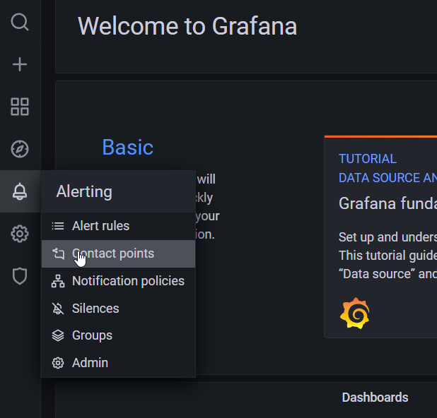
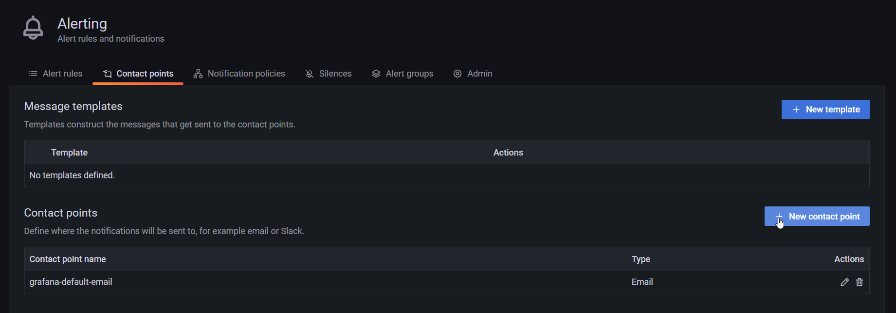
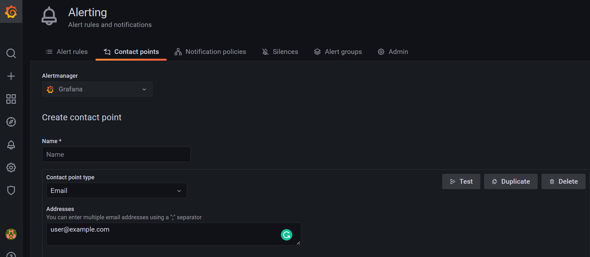
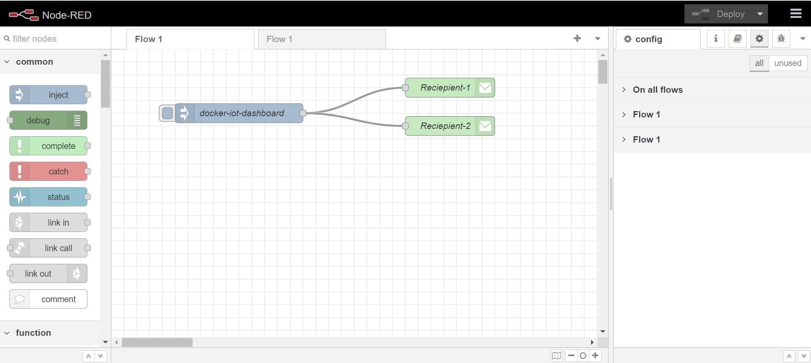
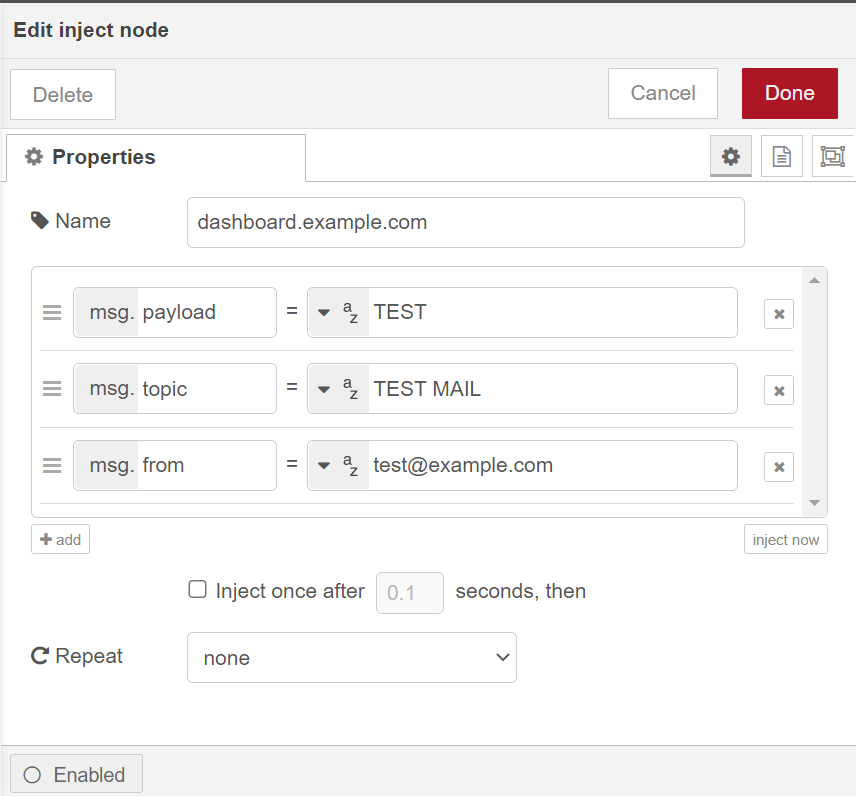
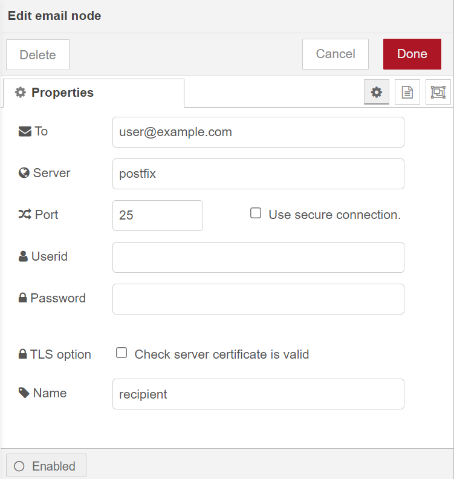

# Step-by-step Setup Instructions

<!-- markdownlint-disable MD033 -->
<!-- markdownlint-capture -->
<!-- markdownlint-disable -->
<!-- TOC depthFrom:2 updateOnSave:true -->

- [Notes](#notes)
- [Cloud-Provider-Specific Setup](#cloud-provider-specific-setup)
	- [On Digital Ocean](#on-digital-ocean)
        - [Create droplet](#create-droplet)
        - [Configure droplet](#configure-droplet)
    - [List of required ports to be opened in the firewall](#list-of-required-ports-to-be-opened-in-the-firewall)
- [After server is set up](#after-server-is-set-up)
	- [Create and edit the .env file](#create-and-edit-the-env-file)
	- [Set up the Node-RED and InfluxDB API logins](#set-up-the-node-red-and-influxdb-api-logins)
		- [Migrating `htpasswd` from Apache to Nginx (if required)](#migrating-htpasswd-from-apache-to-nginx-if-required)
		- [Creating new `htpasswd` files](#creating-new-htpasswd-files)
   - [Set up the `MQTTs` User Credentials](#set-up-the-mqtts-user-credentials)
	- [Start the server](#start-the-server)
	- [Restart servers in the background](#restart-servers-in-the-background)
	- [Initial testing](#initial-testing)
	- [Set up first data source](#set-up-first-data-source)
	- [Test Node-RED](#test-node-red)
	- [Creating an InfluxDB database](#creating-an-influxdb-database)
    - [Test Postfix Mail setup](#test-postfix-mail-setup)
    - [Test MQTT Channels](#test-mqtt-channels)
	

<!-- /TOC -->
<!-- markdownlint-restore -->
<!-- Due to a bug in Markdown TOC, the table is formatted incorrectly if tab indentation is set other than 4. Due to another bug, this comment must be *after* the TOC entry. -->

## Notes

Throughout this document, we use `dashboard.example.com` as the DNS name for the server. You will, of course, change this to something more suitable. When you do this, other things are to be named consistently:

- `/opt/docker/dashboard.example.com` is the directory (on the host system) containing the docker files.

- `/var/opt/docker/dashboard.example.com` is the directory (on the host system) containing persistent data.

Node-RED familiarity is assumed.

## Cloud-Provider-Specific Setup

As an initial step, a cloud provider is required and Docker and Docker-Compose must be installed. The procedure is provider dependent.

### On Digital Ocean

#### Create droplet

1. Log in to [Digital Ocean](https://cloud.digitalocean.com/)

2. Create a new project (if needed) to hold the new droplet.

3. Discover > Marketplace, search for `Docker`

4. This page will be redirected:
    <https://cloud.digitalocean.com/marketplace/5ba19751fc53b8179c7a0071?i=ec3581>

5. Press "Create"

6. Select the standard 8G GB Starter that is selected.

7. Choose a datacenter; *New York is selected in the example created for this document.*

8. Additional options: none.

9. Add the SSH keys.

10. Choose a host name, *e.g. `passivehouse-ecovillage`.*

11. Select the project.

12. Press "Create"

#### Configure droplet

1. Note the IP address from above.

2. `ssh root@{ipaddress}`

3. Remove the motd (message of the day).

4. Add user(s). Change `username` as needed.

   ```bash
    adduser username
    adduser username admin
    adduser username docker
    adduser username plugdev
    adduser username staff
   ```

5. Disable root login via SSH or via password

6. Optional: enable `username` to sudo without password.

   ```bash
   sudo VISUAL=vi visudo
   ```

   Add the following line at the bottom:

   ```bash
   username ALL=(ALL) NOPASSWD: ALL
   ```

7. Test that you can become `username`:

   ```console
   # sudo su - username
   username@host-name:~$
   ```

8. Drop back to root, and then copy the authorized_keys file to   `~username`:

   ```bash
   mkdir -m 700 ~username/.ssh
   cp -p .ssh/authorized_keys ~username/.ssh
   chown -R username.username ~username/.ssh
   ```

9. Confirm that the user can SSH in.

10. Optional: set up byobu by default. This allows a session to continue even if your connection drops.

    ```bash
    byobu
    byobu-enable
    ```

11. Set the host name.

    ```bash
    vi /etc/hosts
    ```

    Change the line `127.0.1.1 name name` to `127.0.0.1 dashboard.myfq.dn dashboard`.

12. If needed, use `hostnamectl` to set the static hostname to match `dashboard`.

13. Set up git. This makes sure you have the latest version.

    ```bash
    sudo add-apt-repository ppa:git-core/ppa
    sudo apt update
    sudo apt install git
    ```

14. We'll put the docker files at `/opt/docker/dashboard.example.com`, setting up as follows:

    ```bash
    sudo mkdir /opt/docker
    cd /opt/docker
    sudo chgrp admin .
    sudo chmod g+w .
    ```

## List of required ports to be opened in the firewall

Remember, if the server is running on a cloud platform like Microsoft Azure or AWS, one needs to check the firewall and confirm that the below ports are open to the outside world.

- 80/tcp
- 443/tcp
- 8883/tcp
- 8083/tcp
- 1883/tcp (if needed; not secure)

## After server is set up

The following instructions are essentially independent of the cloud provider and the underlying distribution. But this was only tested on Ubuntu and (in 2019) on CentOS.

1. Clone this repository.

    ```bash
    git clone git@github.com:mcci-catena/docker-iot-dashboard.git /opt/docker/dashboard.example.com
    ```

2. Move to the directory populated in step 1.

    ```bash
    cd /opt/docker/dashboard.example.com
    ```

3. Get a fully-qualified domain name (FQDN) for the server, for which the DNS can be controlled. Point it to the server. Make sure it works, using "`dig FQDN`" -- get back a `A` record pointing to your server's IP address.

### Create and edit the .env file

First, create a .env file. The following command sequence can be cut and paste to generate an empty template:

```bash
sed -ne '/^#+++/,/^#---/p' docker-compose.yml | sed -e '/^#[^ \t]/d' -e '/^# IOT/s/$/=/' > .env
```

Then, edit the .env file as follows:

1. `IOT_DASHBOARD_NGINX_FQDN=dashboard.example.com`

    This sets the name of the resulting server. It tells Nginx what it's serving out. It must be a fully-qualified domain name (FQDN) that resolves to the IP address of the container host.

2. `IOT_DASHBOARD_AWS_ACCESS_KEY_ID=xxxxxxxxxxxxxxx`

    This sets access key for `s3 bucket` for the data backup.

3. `IOT_DASHBOARD_AWS_SECRET_ACCESS_KEY=xxxxxxxxxxxxxxx`

    This sets secret access key for `s3 bucket` for the data backup.

4. `IOT_DASHBOARD_AWS_DEFAULT_REGION=regionname`

    This sets default region for the `s3 bucket`.

5. `IOT_DASHBOARD_AWS_S3_BUCKET=s3bucketname`

    This sets `s3bucketname` to be used for the whole data backup.

6. `IOT_DASHBOARD_AWS_S3_BUCKET_NGINX=s3bucketname/nginx`

    This creates `nginx` folder for nginx data backup.

7. `IOT_DASHBOARD_AWS_S3_BUCKET_NODERED=s3bucketname/nodered`

    This creates `nodered` folder for nodered data backup.

8. `IOT_DASHBOARD_AWS_S3_BUCKET_GRAFANA=s3bucketname/grafana`

    This creates `grafana` folder for grafana data backup.

9. `IOT_DASHBOARD_AWS_S3_BUCKET_MQTTS=s3bucketname/mqtts`

    This creates `mqtts` folder for mqtts data backup.

10. `IOT_DASHBOARD_AWS_S3_BUCKET_INFLUXDB=s3bucketname/influxdb`

    This creates `influxdb` folder for influxdb database backup.

11. `IOT_DASHBOARD_AWS_S3_BUCKET_MONGODB=s3bucketname/mongodb`

    This creates `mongodb` folder for mongodb database backup.

12. `IOT_DASHBOARD_AWS_HOST_BASE=s3.amazonaws.com`

    This sets S3 endpoint to configure 3rd party clients(s3cmd).

    For Amazon: s3.amazonaws.com

    For DigitalOcean: `nyc3`.digitaloceanspaces.com

    Please change the region `nyc3` with your s3 bucket region for the DigitalOcean.

13. `IOT_DASHBOARD_AWS_HOST_BUCKET='%(${IOT_DASHBOARD_AWS_S3_BUCKET})s.s3.amazonaws.com'`

    This sets S3 endpoint to access host bucket.

    For Amazon: '%(${IOT_DASHBOARD_AWS_S3_BUCKET})s.s3.amazonaws.com'

    For DigitalOcean: '%(${IOT_DASHBOARD_AWS_S3_BUCKET}).`nyc3`.digitaloceanspaces.com'

    Please change the region `nyc3` with your s3 bucket region for the DigitalOcean.

14. `IOT_DASHBOARD_CERTBOT_EMAIL=someone@example.com`

    This sets the contact email for Let's Encrypt. The script automatically accepts the Let's Encrypt terms of service, and this indicates who is doing the accepting.

15. `IOT_DASHBOARD_CERTBOT_FQDN=dashboard.example.com`

    This should be the same as`IOT_DASHBOARD_NGINX_FQDN`.

16. `IOT_DASHBOARD_DATA=/full/path/to/directory/`

    The trailing slash is required! This will put all the data files for this instance as subdirectories of the specified path. If this is undefined,`docker-compose`will print error messages and quit.

17. `IOT_DASHBOARD_GRAFANA_ADMIN_PASSWORD=SomethingVerySecretIndeed`

    This needs to be confidential. Indeed, this sets the *initial* password for the Grafana admin login. This should be changed via the Grafana UI after booting the server.

18. `IOT_DASHBOARD_GRAFANA_SMTP_FROM_ADDRESS`

    This sets the Grafana originating mail address.

19. `IOT_DASHBOARD_GRAFANA_INSTALL_PLUGINS=plugin plugin2`

    This sets a list of Grafana plugins to install.

20. `IOT_DASHBOARD_INFLUXDB_INITIAL_DATABASE_NAME=demo`

    Change "demo" to the desired name of the initial database that will be created in InfluxDB.

21. `IOT_DASHBOARD_MAIL_DOMAIN=example.com`

    This sets the domain name of your mail server. Used by Postfix.

22. `IOT_DASHBOARD_MAIL_HOST_NAME=dashboard.example.com`

    This sets the name of your mail server. Used by Postfix.

23. `IOT_DASHBOARD_MAIL_RELAY_IP=xx.xx.xx.xx:port`

    This sets SMTP server through which your Emails will be forwarded.

24. `IOT_DASHBOARD_MAIL_SMTP_AUTH=<yes|no>`

    This enables/disables SMTP authentication to access the SMTP server.

25. `IOT_DASHBOARD_MAIL_SMTP_LOGIN=xxxxx`

    This sets credential to access the above SMTP server

26. `IOT_DASHBOARD_MAIL_SMTP_PASSWORD=xxxxxx`

    This sets credential to access the above SMTP server

27. `IOT_DASHBOARD_NODERED_INSTALL_PLUGINS=node-red-node-module1 node-red-node-module2`

    This installs one or more Node-RED plug-ins.

28. `IOT_DASHBOARD_TIMEZONE=Europe/Paris`

    If not defined, the default time zone will be GMT.

29. `IOT_DASHBOARD_INFLUXDB_MAIL_HOST_NAME=dashboard.example.com`

    This sets the name of your mail server for backup mail. Used by Postfix.

30. `IOT_DASHBOARD_INFLUXDB_BACKUP_EMAIL=a@example.com b@example.com`

    InfluxDB Backup mail will be sent to the mentioned MAIL IDs.

31. `IOT_DASHBOARD_CRON_BACKUP_EMAIL=a@example.com b@example.com`

    Backup mail for `Grafana, Mongodb, Mqtts, Nginx, and Nodered` will be sent to the mentioned MAIL IDs.

32. `IOT_DASHBOARD_MONGO_INITDB_ROOT_USERNAME=xxxxxx`

    This sets username to be used for accessing Mongodb.

33. `IOT_DASHBOARD_MONGO_INITDB_ROOT_PASSWORD=xxxxxxxxx`

    This sets password to be used for accessing Mongodb root user.

The resulting `.env` file should look like this:

```bash
### env file for configuring dashboard.example.com

IOT_DASHBOARD_NGINX_FQDN=dashboard.example.com
#   The fully-qualified domain name to be served by NGINX.
#
IOT_DASHBOARD_AWS_ACCESS_KEY_ID=xxxxxxxxxxxxxx
#   The access key for AWS for backups.
#
IOT_DASHBOARD_AWS_SECRET_ACCESS_KEY=xxxxxxxxxxxxxx
#   The AWS API secret key for backing up influxdb data.
#
IOT_DASHBOARD_AWS_DEFAULT_REGION=us-east-1
#   The AWS default region.
#
IOT_DASHBOARD_AWS_S3_BUCKET=dashboard.example.com
#   The name of S3 host bucket.
#
IOT_DASHBOARD_AWS_S3_BUCKET_NGINX=dashboard.example.com/nginx
#   The name of S3 bucket for Nginx backup
#
IOT_DASHBOARD_AWS_S3_BUCKET_NODERED=dashboard.example.com/nodered
#   The name of S3 bucket for Node-red backup
#
IOT_DASHBOARD_AWS_S3_BUCKET_GRAFANA=dashboard.example.com/grafana
#   The name of S3 bucket for Grafana backup
#
IOT_DASHBOARD_AWS_S3_BUCKET_MQTTS=dashboard.example.com/mqtts
#   The name of S3 bucket for Mqtts backup
#
IOT_DASHBOARD_AWS_S3_BUCKET_INFLUXDB=dashboard.example.com/influxdb
#   The S3 bucket to be used for uploading the influxdb backup data.
#
IOT_DASHBOARD_AWS_S3_BUCKET_MONGODB=dashboard.example.com/mongodb
#   The S3 bucket to be used for uploading the mongodb backup data.
#
IOT_DASHBOARD_AWS_HOST_BASE=nyc3.digitaloceanspaces.com
#   The S3 endpoint is used to configure 3rd party clients(s3cmd).
#   For Amazon:  s3.amazonaws.com , For DigitalOcean: nyc3.digitaloceanspaces.com
#
IOT_DASHBOARD_AWS_HOST_BUCKET='%(${IOT_DASHBOARD_AWS_S3_BUCKET}).nyc3.digitaloceanspaces.com'
#   The S3 endpoint to access host bucket.
#   For Amazon: '%(${IOT_DASHBOARD_AWS_S3_BUCKET})s.s3.amazonaws.com'
#   For DigitalOcean: '%(${IOT_DASHBOARD_AWS_S3_BUCKET}).nyc3.digitaloceanspaces.com'
#
IOT_DASHBOARD_CERTBOT_EMAIL=someone@dashboard.example.com
#   The email address to be used for registering with Let's Encrypt.
#
IOT_DASHBOARD_CERTBOT_FQDN=dashboard.example.com
#   The domain(s) to be used by cert bot when registering with Let's Encrypt.
#
IOT_DASHBOARD_DATA=/var/opt/docker/dashboard.example.com/
#   The path to the data directory. This must end with a '/', and must either
#   be absolute or must begin with './'. (If not, you'll get parse errors.)
#
IOT_DASHBOARD_GRAFANA_ADMIN_PASSWORD=xxxxxxxx
#   The password to be used for the admin user on first login. This is ignored
#   after the Grafana database has been built.
#
IOT_DASHBOARD_GRAFANA_PROJECT_NAME=Testing IoT Server
#   The project name to be used for the emails from the administrator.
#
# IOT_DASHBOARD_GRAFANA_LOG_MODE=
#   Set the grafana log mode.
#
# IOT_DASHBOARD_GRAFANA_LOG_LEVEL=
#   Set the grafana log level (e.g. debug)
#
# IOT_DASHBOARD_GRAFANA_SMTP_ENABLED=
#   Set to false to disable SMTP.
#   Defaults to true
#
# IOT_DASHBOARD_GRAFANA_SMTP_SKIP_VERIFY=
#   Set to false to enable SSL verification.
#   Defaults to true.
#
IOT_DASHBOARD_GRAFANA_INSTALL_PLUGINS=plugin1, plugin2, plugin3
#   A list of grafana plugins to install. Use (comma and space) ", " to delimit plugins.
#
IOT_DASHBOARD_GRAFANA_SMTP_FROM_ADDRESS=grafana-admin@dashboard.example.com
#   The "from" address for Grafana emails.
#
# IOT_DASHBOARD_GRAFANA_USERS_ALLOW_SIGN_UP=
#   Set to true to allow users to sign up.
#
IOT_DASHBOARD_INFLUXDB_ADMIN_PASSWORD=xxxxxxxx
#   The password to be used for the admin user by influxdb. Again, this is
#   ignored after the influxdb database has been built.
#
IOT_DASHBOARD_INFLUXDB_INITIAL_DATABASE_NAME=demo
#   The initial database to be created on first launch of influxdb. Ignored
#   after influxdb has been launched.
#
IOT_DASHBOARD_MAIL_DOMAIN=example.com
#   The postfix mail domain.
#
IOT_DASHBOARD_MAIL_HOST_NAME=dashboard.example.com
#   The external FQDN for the mail host.
#
IOT_DASHBOARD_MAIL_RELAY_IP=[smtp.example.com]:465
#   The mail relay machine, assuming that the real mailer is upstream from us.
#
IOT_DASHBOARD_MAIL_SMTP_AUTH=yes
#   To enable SMTP authentication, set to "yes".
#   Defaults to "no"
#
IOT_DASHBOARD_MAIL_SMTP_LOGIN=iotdashboard@example.com
#   The mail relay login: name@example.com -- it will come from your upstream provider.
#
IOT_DASHBOARD_MAIL_SMTP_PASSWORD=xxxxxxxx
#   The mail relay password
#
IOT_DASHBOARD_MAIL_TLS_SECURITY_LEVEL=encrypt
#   To enable SSL/TLS support for postfix container. set to "encrypt" to enable SSL/TLS
#   Defaults to "may"
#
IOT_DASHBOARD_MAIL_TLS_WRAPPERMODE=yes
#   To enable SSL/TLS support for postfix container. set to "yes" to enable SSL/TLS
#   Defaults to "no"
#
# IOT_DASHBOARD_PORT_HTTP=
#   The port to listen to for HTTP. Primarily for test purposes. Defaults to 80.
#
# IOT_DASHBOARD_PORT_HTTPS=
#   The port to listen to for HTTPS. Primarily for test purposes. Defaults to 443.
#
IOT_DASHBOARD_TIMEZONE=Etc/GMT
#   The timezone to use. Defaults to GMT.
#
# IOT_DASHBOARD_NODE_RED_VERSION=
#   To Install specific version of node-red version. Defaults to latest.
#
IOT_DASHBOARD_NODE_RED_INSTALL_MODULES=module1 module2 module3
#   To Install the required node-red modules. use "space" to delimit the modules.
#
# IOT_DASHBOARD_PORT_MQTT_TCP=
#   Accessing mqtt channel over TCP. Defaults to 1883.
#
# IOT_DASHBOARD_PORT_MQTT_SSL=
#   Accessing mqtt channel over TLS/SSL. Defaults to 8883.
#
# IOT_DASHBOARD_PORT_MQTT_WSS=
#   Accessing mqtt channel over WSS. Defaults to 8083.
#
IOT_DASHBOARD_INFLUXDB_MAIL_HOST_NAME=influxdb.example.com
#   The external FQDN for the influxdb host
#
IOT_DASHBOARD_INFLUXDB_BACKUP_EMAIL=someone@dashboard.example.com
#   To send backup mail in Influxdb container. Use "space" to delimit the MAIL IDs.
#
IOT_DASHBOARD_CRON_BACKUP_EMAIL=someone@dashboard.example.com
#   To send backup mail in cron-backup container. Use "space" to delimit the MAIL IDs.
#
IOT_DASHBOARD_MONGO_INITDB_ROOT_USERNAME=xxxxxxx
#   The Username to be used for accessing Mongodb.
#
IOT_DASHBOARD_MONGO_INITDB_ROOT_PASSWORD=xxxxxxx
#   The Password to be used for accessing Mongodb root user.
#

```

### Set up the Node-RED and InfluxDB API logins

Run the following commands.

```bash
docker-compose pull
docker-compose build
```

If there are any errors, they need to be fixed before going on.

#### Migrating `htpasswd` from Apache to Nginx (if required)

If migrating from an older version of the dashboard that used Apache, you'll need to migrate the `htpasswd` file.

- Copy [`htpasswd_migration.sh`](./htpasswd_migration.sh) into your local directory (on the host system) containing the docker files.

- Run the script as below.

    ```bash
    chmod +x htpasswd_migration.sh
    ./htpasswd_migration.sh
    ```

- This script creates one `htpasswd` for each of the controlled services, and then copies them(`node-red_htpasswd`, `query_htpasswd`) to appropriate files as below.

  - For Node-red:
    `${IOT_DASHBOARD_DATA}docker-nginx/authdata/nodered/.htpasswd`

  - For Influxdb Queries:
    `${IOT_DASHBOARD_DATA}docker-nginx/authdata/influxdb/.htpasswd`

- If you are migrating older `htpasswd` files, please skip steps `[1-4]` to `htpasswd` below.

#### Creating new `htpasswd` files

1. Log into the Nginx docker container.

    ```console
    $ docker-compose run nginx /bin/bash
    #
    ```

   If this fails with the message,`ERROR: Couldn't connect to Docker daemon at http+docker://localunixsocket - is it running?`, then probably the user ID is not in the`docker`group. To fix this,`sudo adduser MYUSER docker`, where "MYUSER" is the login ID. Then (**very important**) log out and log back in.

2. Create `.htpasswd` files for node-red and influxdb queries authentication.

    ```bash
    touch /etc/nginx/authdata/influxdb/.htpasswd
    touch /etc/nginx/authdata/nodered/.htpasswd
    chown www-data /etc/nginx/authdata/influxdb/.htpasswd
    chown www-data /etc/nginx/authdata/nodered/.htpasswd
    ```

3. Add user logins for node-red and influxdb queries. Make`USERS`be a list of login IDs.

   - For Node-red authentication:

       ```bash
       export USERS="tmm amy josh"
       for USER in $USERS; do \
        echo "Set password for "$USER; \
        htpasswd /etc/nginx/authdata/nodered/.htpasswd $USER; \
       done
       ```

   - For Influxdb queries:

       ```bash
       export USERS="tmm amy josh"
       for USER in $USERS; do \
        echo "Set password for "$USER; \
        htpasswd /etc/nginx/authdata/influxdb/.htpasswd $USER; \
       done
       ```

4. Exit Nginx's container with Control+D.

#### Set up the `MQTTs` User Credentials

To access mqtt channel, user needs credentials to access it.

1. Log into the mqtts docker container.

   ```console
   $ docker-compose run mqtts /bin/bash
   #
   ```

2. In the container, Create username and password using `mosquitto_passwd` command. (option `-c` - Create a new password file. If the file already exists, it will be overwritten. So `-c` should be used for the first user creation. Please avoid `-c` for the second user creation onwards.)

   ```bash
   # mosquitto_passwd -c /etc/mosquitto/credentials/passwd <user>
   Password:
   Reenter password:
   ```

3. Close the connection to mqtts (Ctrl+D).

### Start the server

1. Starting things up in "interactive mode" is recommended as a first step.

    ```bash
    docker-compose up
    ```

This will show the log output from the various services. It will also be pretty clear if there are any issues.

One common error (for me, anyway) is entering an illegal initial InfluxDB database name. InfluxDB will spew a number of errors, but eventually it will start up anyway. But then the database needs to be created manually.

### Restart servers in the background

Once the servers are coming up interactively, use ^C to shut them down, and then restart in daemon mode.

```bash
docker-compose up -d
```

Status of the containers can be seen as below

```console
$ docker-compose ps
        Name                      Command                  State                                        Ports
-----------------------------------------------------------------------------------------------------------------------------------------------
dashboard.example.com_apiserver_1     /sbin/my_init                    Up             0.0.0.0:6789->22/tcp,:::6789->22/tcp, 8891/tcp, 8892/tcp, 8893/tcp
dashboard.example.com_cron-backup_1   /sbin/my_init                    Up
dashboard.example.com_expo_1          /sbin/my_init                    Up             19006/tcp, 0.0.0.0:6791->22/tcp,:::6791->22/tcp
dashboard.example.com_grafana_1       /run.sh                          Up             3000/tcp
dashboard.example.com_influxdb_1      /sbin/my_init                    Up             8086/tcp
dashboard.example.com_mongodb_1       docker-entrypoint.sh mongod      Up             27017/tcp
dashboard.example.com_mqtts_1         /sbin/my_init                    Up             0.0.0.0:8083->8083/tcp,:::8083->8083/tcp,0.0.0.0:8883->8883/tcp,:::8883->8883/tcp
dashboard.example.com_nginx_1         /sbin/my_init                    Up             0.0.0.0:27020->27020/tcp,:::27020->27020/tcp,0.0.0.0:443->443/tcp,::443->443/tcp, 0.0.0.0:80->80/tcp,:::80->80/tcp
dashboard.example.com_node-red_1      npm --no-update-notifier - ...   Up (healthy)   1880/tcp
dashboard.example.com_postfix_1       /sbin/my_init                    Up             0.0.0.0:2525->25/tcp,:::2525->25/tcp
```

### Initial testing

- Open Grafana on [https://dashboard.example.com](https://dashboard.example.com/), and log in as admin.

- Change the admin password.

### Set up first data source

Use the Grafana UI -- either click on "add first data source" or use "Configure >Add Data Source", and add an InfluxDB data source.

- Set the URL (under HTTP Settings) to `<http://influxdb:8086>`.

- Select the database. If InfluxDB is properly initialized in a database, connect to it as a Grafana data source. If not, [create an InfluxDB database](https://github.com/mcci-catena/docker-iot-dashboard/blob/master/SETUP.md#creating-an-influxdb-database).

- Leave user and password blank.

- Click "Save & Test".

### Test Node-RED

Open Node-RED on <https://dashboard.example.com/node-red/>, and build a flow that stores data in InfluxDB. **Be sure to add the trailing slash! Otherwise, a 404 error pops from Grafana. This will be fixed soon.**

### Creating an InfluxDB database

To create a database, log in to the host machine, and cd to `/opt/docker/dashboard.example.com`. Use the following commands:

```console
$ docker-compose exec influxdb /bin/bash
# influx
Connected to http://localhost:8086 version 1.7.6
InfluxDB shell version: 1.7.6
Enter an InfluxQL query
> show databases
name: databases
name
----
_internal
> create database "my-new-database"
> show databases
name: databases
name
----
_internal
my-new-database
> ^D
# ^D
$
```

### Test Postfix Mail setup

- Testing Mail setup on `Grafana`
  1. Click on "Bell icon" and click the "Notification channels" option as shown below

        

  2. Click "Add Channel" as shown below

        
  
  3. Input the required info as shown below. *Be sure to select type as `Email`*. Click `Test` button finally to send test mail.

        

- Testing Mail setup on `Influxdb` and `Postfix`

    Mail setup on `Influxdb` and `Postfix` can be tested using `mail` command, by logging into their container.

    ***Influxdb***
    1. Log into the `Influxdb` docker container

    ```bash
    docker-compose exec influxdb bash

    root@influxdbbackup:/# mail -s "Testing mail from Influxdb" cmurugan@mcci.com
    Cc:
    Testing1
    ```

    ***Postfix***

    1. Log into the `Postfix` docker container

    ```bash
    docker-compose exec postfix bash

    root@dashboard:/# mail -s "Testing mail from Postfix" cmurugan@mcci.com
    Cc:
    Testing1
    ```

- Testing Mail setup on Node-red

    Mail setup on Node-red can be tested by deploying a node-red flow on <https://dashboard.example.com/node-red/> as shown below.

    

    ***Inject node's configuration***

    

    Here,
  - `msg.payload` will be acted as `mail body`.
  - `msg.topic`will be acted as `subject`.
  - `msg.from` will be acted as `Sender`

   ***Email node's configuration***

    

### Test MQTT Channels

- To test the `MQTT over TCP` and `MQTT over TLS/SSL` channels user can use [mosquitto client](https://mosquitto.org/download/) tool.

  - MQTT over TCP

      `Subscribing` mqtt channel on topic `test`

      ```bash
      mosquitto_sub -h dashboard.example.com -t test -p 1883 -u user1 -P pwd123
      
      hello
      ```

      `publishing` on mqtt channel with topic `test`

      ```bash
      mosquitto_pub -h dashboard.example.com -m "hello" -t test -p 1883 -u user1 -P pwd123
      ```

  - MQTT over TLS/SSL

      `Subscribing` mqtt channel on topic `test`

      ```bash
      mosquitto_sub -h dashboard.example.com -t test -p 8883 -u user1 -P pwd123 --capath /etc/ssl/certs/
      
      hello 
      ```

      `publishing` on mqtt channel with topic `test`

      ```bash

      mosquitto_pub -h dashboard.example.com -m "hello" -t test -p 8883 -u user1 -P pwd123 --capath /etc/ssl/certs/
      ```

- In order to test the "MQTT over Nginx proxy", the user can use the `mqtts web based client` [portal1](http://tools.emqx.io/) or [portal2](https://www.eclipse.org/paho/clients/js/utility/).

   *Using [portal1](http://tools.emqx.io/)*

   Connection Details

   

   `Subscribing` mqtt channel on topic `test`

   

   `publishing` on mqtt channel with topic `test`

   

   Full window

   

- To test the `MQTT over WebSockets with TLS/SSL`, the user can use the `mqtts web based client` [Portal](http://www.hivemq.com/demos/websocket-client/).

   Connection Details

   

  `Subscribing` mqtt channel on topic `test`

   

   `publishing` on mqtt channel with topic `test`

   

   Full window

   
